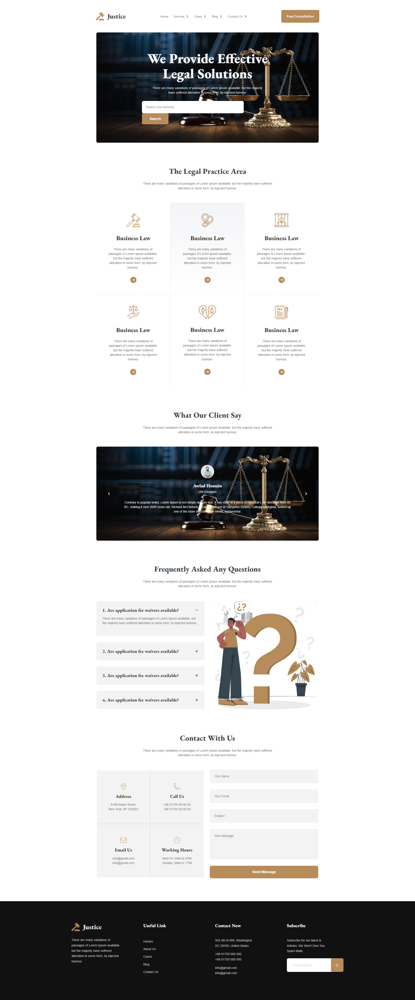

# Legal Solutions

A simple legal services website built as an early frontend project to practice **HTML and CSS**.

The website presents a professional-looking layout for a legal service company, including information about legal services, clients, testimonials, FAQs, and contact details.

## Live Website

[View Live Website](https://fahmidaaktershimu.github.io/Legal-Solutions/)

## Features

* Navigation bar
* Hero/banner section
* The Legal Practice Area
* Client's Review
* Frequently Asked Questions (FAQ)
* Contact section
* Footer

## Technologies Used

* HTML5
* CSS3
* Tailwind CSS
* Font Awesome

## Screenshot



> Add your project screenshot inside the `screenshots` folder and name it `screenshot.png`.

## Project Structure

```text
Legal-Solutions/
├── images/
├── index.html
├── legal.css
└── README.md
```

### GitHub: [FahmidaAkterShimu](https://github.com/FahmidaAkterShimu)
